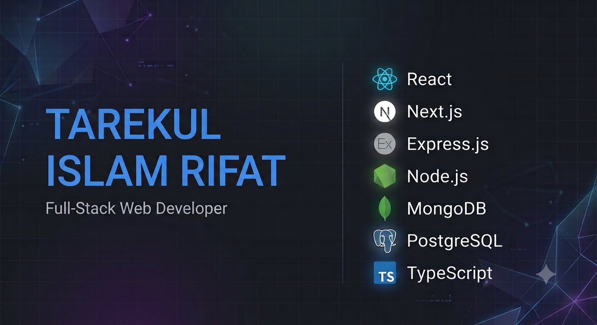

# Tarekul Islam Rifat

Full-Stack Developer (MERN) — focused on backend architecture, security, and scalable web applications.

📍 Dhaka, Bangladesh · 📧 tarekulrifat142@gmail.com · 🟢 Open to opportunities

---

## 👋 About Me

Full-Stack Developer with a strong focus on building secure, scalable, and maintainable web applications using the MERN stack, TypeScript, and Next.js. Passionate about backend architecture, system design, and continuously improving through building real-world software.

- 🔭 Currently building — Full-stack applications with Next.js, React, TypeScript, Express.js, PostgreSQL, and Prisma
- 🌱 Exploring — Bun runtime, microservices architecture, observability, and system design
- 👯 Interested in — Open-source contributions, developer tooling, fintech, and edtech products
- 💬 Ask me about — React, Next.js, Node.js, Express.js, MongoDB, PostgreSQL, authentication, backend architecture, and REST APIs
- 🎯 Open to — Full-Stack Developer, Backend Developer, and Software Engineering opportunities

---

## 🛠️ Engineering Focus

Backend — REST APIs · Modular Architecture · Authentication · RBAC · Redis · Background Jobs

Security — JWT · CSRF Protection · Rate Limiting · Input Validation · Secure Authentication

Frontend — React · Next.js App Router · TypeScript · Scalable UI Architecture

Infrastructure — Docker · GitHub Actions · Vitest · Playwright · Prometheus · CI/CD

---

## 🛠️ Tech Stack

### Languages

### Frontend

### Backend

### Database & Cache

### Testing & DevOps

### Tools

## 📊 GitHub Stats

  

## ⏱️ Coding Activity

  

  

## 🤝 Connect

[LinkedIn](https://linkedin.com/in/tarekul42) · [GitHub](https://github.com/tarekul42) · [Twitter](https://twitter.com/tarekul42) · [Facebook](https://facebook.com/tarekul42) · [Dev.to](https://dev.to/tarekul42) · [Medium](https://medium.com/@tarekul42) · [Portfolio](https://tarekul42.vercel.app)

  Built by Tarekul Islam Rifat

